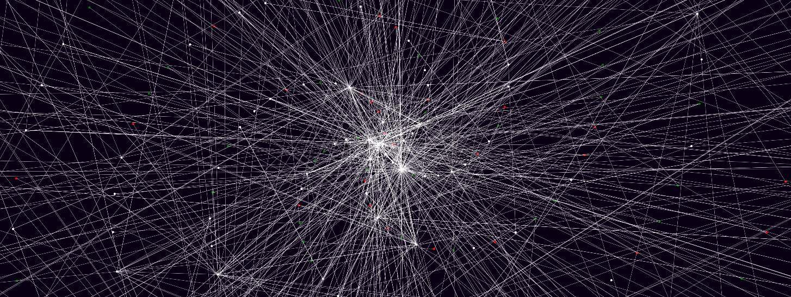

# [StellarVisualiser](https://cimera42.github.io/StellarVisualiser/)

https://cimera42.github.io/StellarVisualiser/

Visualiser for the [Stellar Network](https://www.stellar.org/)

Shows links between addresses, with colours of nodes representing positive (green)/negative (red) balance.

